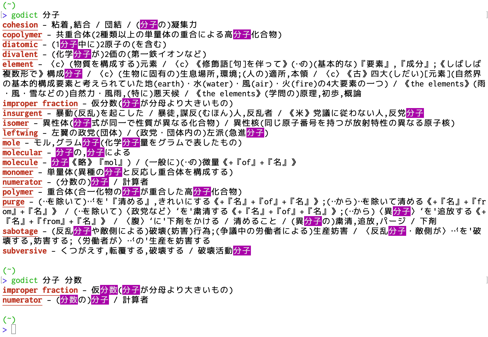
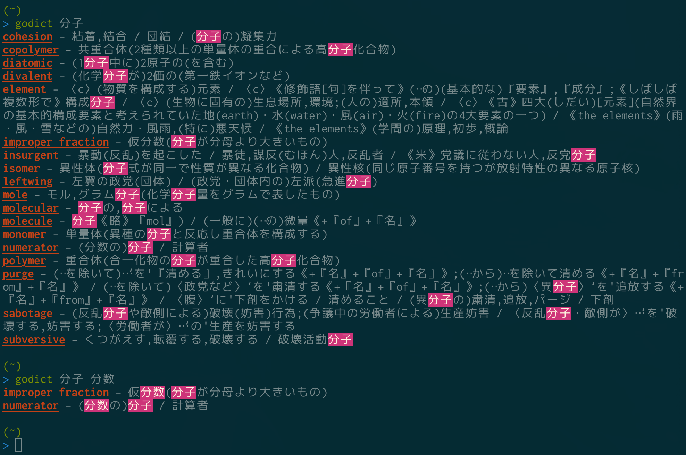

# godict

`godict` is a simple dictionary in terminals.
The main target is translating Japanese words to the most matched English word.

`godict` uses [EJDict](https://github.com/kujirahand/EJDict).

## Usage

`godict word1 word2 ..`

Space delimited words are used for AND search words.

## Screenshots

## Install

`go get -u github.com/my0k/godict`

## License

This software is released under the MIT License, see [LICENSE](./LICENSE).

