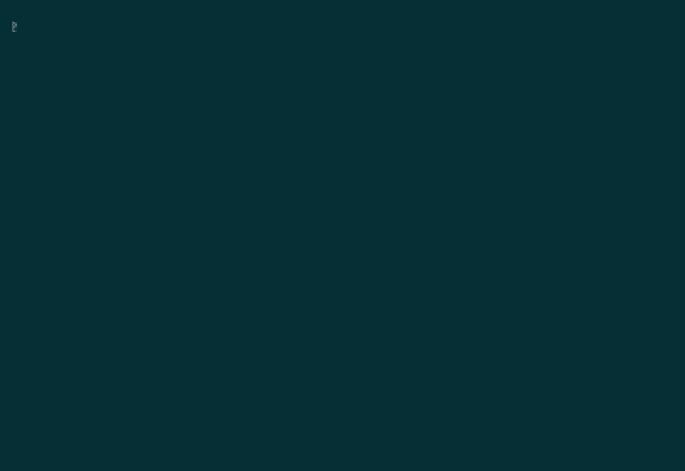

# godict

`godict` is a simple dictionary in terminals written in Go.
The main target is translating Japanese words to the most matched English word.

[EJDict](https://github.com/kujirahand/EJDict) is used in `godict`.

## Usage

`godict word1 word2 ..`

Space delimited words are used for AND search.

## Demo

## Install

If you have a Go environment, you can use `go get`.

`go get -u github.com/my0k/godict`

Or you can download binaries for each platform from [release](https://github.com/my0k/godict/releases).

## Screenshots

## License

This software is released under the MIT License, see [LICENSE](./LICENSE).
